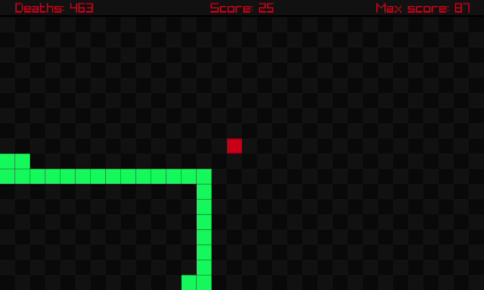

# snake-rl
Snake learns to survive using reinforcement learning.



## Q-learning algorithm
[Q-learning](https://en.wikipedia.org/wiki/Q-learning) is a model-free reinforcement learning algorithm to learn the value of an action in a particular state. This is done by means of a look up table called *Q-table* which stores a quality value *Q* for every pair of state *S* and action *a* to be taken in that state. Meaning that in a given state *S*, the best move *a* is the one associated with the highest *Q* value.

At the start, the *Q-table* is initialized with zeros and its entries are updated iteratively during the game using the [Bellman equation](https://en.wikipedia.org/wiki/Bellman_equation). To fill up the *Q-table* quickly, a strategy called *ε-greedy* is implemented to encourage exploration of game states by choosing random moves with probability `ε` or optimal moves using the *Q-table* values with probability `(1-ε)`. At the starts of the game `ε` is set to `1.0` (exploration phase) and is slowly decreased throuhgout the training to `0.0` (exploitation phase).

### State representation
The *Q-learning* algorithm, despite the strategies to encourage exploration, falters with increasing numbers of states/actions since the likelihood of the agent visiting a particular state and performing a particular action is increasingly small.

However, since *Snake* is a really simple game we can engineer a state representation *S* which only takes up `8-bits` of information, meaning we only have to deal with `256` states!

Here's how:

- `Bit0`:&nbsp;Apple Y coordinate is greated than Snake's head Y coordinate (Apple is above)
- `Bit1`:&nbsp;Apple Y coordinate is smaller than Snake's head Y coordinate (Apple is below)
- `Bit2`:&nbsp;Apple X coordinate is smaller than Snake's head X coordinate (Apple is on the left)
- `Bit3`:&nbsp;Apple X coordinate is greater than Snake's head X coordinate (Apple is on the right)
- `Bit4`:&nbsp;Snake's body or wall just above Snake's head
- `Bit5`:&nbsp;Snake's body or wall just below Snake's head
- `Bit6`:&nbsp;Snake's body or wall just left of Snake's head
- `Bit7`:&nbsp;Snake's body or wall just right of Snake's head

In this way we can compress all the redundant information given by the full game matrix in a single byte, also making the state independent of the matrix dimensions. Given that there are 5 actions { `IDLE`, `UP`, `DOWN`, `LEFT`, `RIGHT` }, the shape of the *Q-table* will be: `(256, 5)`.

### Reward
Finally, the reward given to the *Snake* during training is the following:

- `+10`:&nbsp;If the *Snake* eats an apple
- `-10`:&nbsp;If the *Snake* dies
- &nbsp;&nbsp;&nbsp;`0`:&nbsp;Otherwise

This value is used in the *Bellman equation* as the immediate reward *R* for taking action *a* in state *S*.

### Performance
The *Snake* typically learns how to play in about 15/20 minutes and, if more time is given, it can even get to grow 90 blocks in length! However, given its *short sightedness* due to the simplistic state space representation, this is the maximum that he was able to archieve.

## Installation
*snake-rl* is written in the C language and uses the [raylib](https://www.raylib.com/) simple cross-platform graphics library built on top of *OpenGL*. You can follow the installation steps of *raylib* for your operating system at the [raylib GitHub repository](https://github.com/raysan5/raylib).

**Disclamer**: Although *raylib* is also supported on *Windows* and *macOS*, the game has been compiled and tested only on *GNU Linux*.

## Build using make
You can build *snake-rl* using make, just use the following:
```bash
git clone https://github.com/Gualor/snake-rl.git
cd snake-rl
make
```

## Usage
For running the application just use the following:
```bash
make run
```
or:
```bash
./build/snake
```
This will create a new game window and *Snake* will start learning how to play at lightning speed!

### Save/load state
Training sessions can take up some time until we can see *Snake* surviving and getting longer and longer (about 15 min). You can save the *Q-table* values to file and load it next time you want to resume the training:
```bash
./build/snake -s .
```
This will create a `snake.qtable` file which contains the *Q-table* values in *CSV* format. If the file already exists it will be overitten.

To load the *snake.qtable* file and resume training, run the following:
```bash
./build/snake -l ./snake.qtable
```
**NB**: *ε* parameter is not stored inside the *snake.qtable* file, therefore when loading the file *ε* is automatically set to `0.0` since it is assumed that exploration phase has already ended.